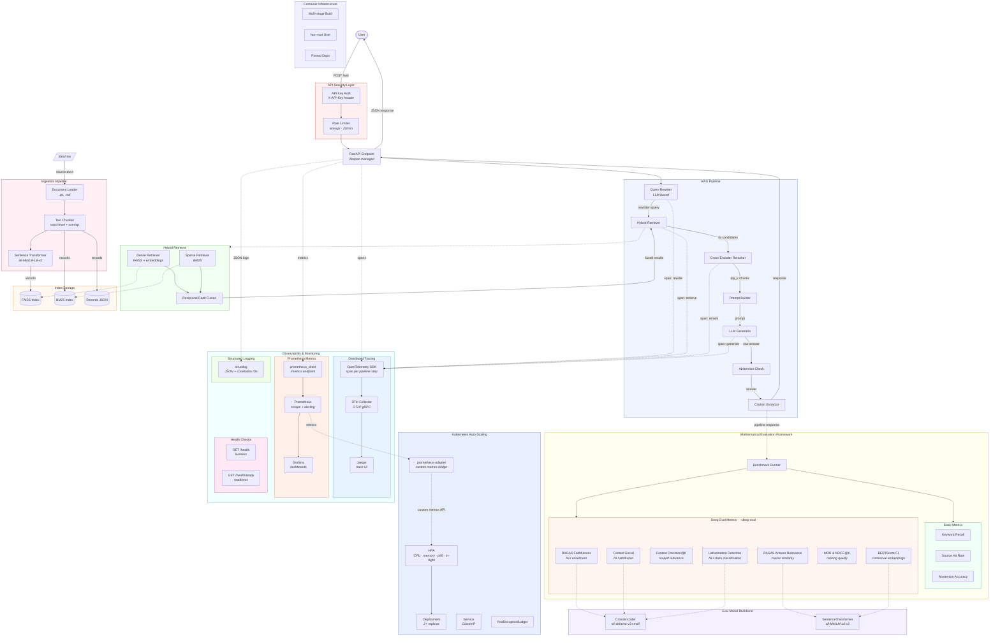

```mermaid
flowchart TD
    User([User]) -->|POST /ask| AUTH

    subgraph Security["API Security Layer"]
        direction TB
        AUTH[API Key Auth<br/><i>X-API-Key header</i>]
        RL[Rate Limiter<br/><i>slowapi · 20/min</i>]
        AUTH --> RL
    end

    RL --> API[FastAPI Endpoint<br/><i>lifespan managed</i>]

    subgraph Pipeline["RAG Pipeline"]
        direction TB
        QR[Query Rewriter<br/><i>LLM-based</i>]
        HR[Hybrid Retriever]
        RR[Cross-Encoder Reranker]
        PB[Prompt Builder]
        GEN[LLM Generator]
        AB[Abstention Check]
        CE[Citation Extractor]

        QR -->|rewritten query| HR
        HR -->|3x candidates| RR
        RR -->|top_k chunks| PB
        PB -->|prompt| GEN
        GEN -->|raw answer| AB
        AB -->|answer| CE
    end

    subgraph Retrieval["Hybrid Retrieval"]
        direction LR
        DR[Dense Retriever<br/><i>FAISS + embeddings</i>]
        SR[Sparse Retriever<br/><i>BM25</i>]
        RRF[Reciprocal Rank Fusion]
        DR --> RRF
        SR --> RRF
    end

    subgraph Storage["Index Storage"]
        direction LR
        FAISS[(FAISS Index)]
        BM25[(BM25 Index)]
        RECORDS[(Records JSON)]
    end

    subgraph Ingestion["Ingestion Pipeline"]
        direction TB
        LOADER[Document Loader<br/><i>.txt, .md</i>]
        CHUNKER[Text Chunker<br/><i>word-level + overlap</i>]
        EMBEDDER[Sentence Transformer<br/><i>all-MiniLM-L6-v2</i>]
        LOADER --> CHUNKER --> EMBEDDER
    end

    subgraph Evaluation["Mathematical Evaluation Framework"]
        direction TB
        BENCH[Benchmark Runner]

        subgraph BasicMetrics["Basic Metrics"]
            KR[Keyword Recall]
            SH[Source Hit Rate]
            AA[Abstention Accuracy]
        end

        subgraph DeepMetrics["Deep Eval Metrics · --deep-eval"]
            FAITH[RAGAS Faithfulness<br/><i>NLI entailment</i>]
            RELEV[RAGAS Answer Relevance<br/><i>cosine similarity</i>]
            CP[Context Precision@K<br/><i>ranked relevance</i>]
            CR[Context Recall<br/><i>NLI attribution</i>]
            BS[BERTScore F1<br/><i>contextual embeddings</i>]
            MR[MRR & NDCG@K<br/><i>ranking quality</i>]
            HD[Hallucination Detection<br/><i>NLI claim classification</i>]
        end

        BENCH --> BasicMetrics
        BENCH --> DeepMetrics
    end

    subgraph EvalModels["Eval Model Backbone"]
        direction LR
        NLI[CrossEncoder<br/><i>nli-deberta-v3-small</i>]
        EMB[SentenceTransformer<br/><i>all-MiniLM-L6-v2</i>]
    end

    subgraph Docker["Container Infrastructure"]
        direction LR
        MS[Multi-stage Build]
        NR[Non-root User]
        PIN[Pinned Deps]
    end

    subgraph K8s["Kubernetes Auto-Scaling"]
        direction TB
        DEP[Deployment<br/><i>2+ replicas</i>]
        SVC[Service<br/><i>ClusterIP</i>]
        HPA[HPA<br/><i>CPU · memory · p95 · in-flight</i>]
        PDB[PodDisruptionBudget]
        PA[prometheus-adapter<br/><i>custom metrics bridge</i>]
        HPA --> DEP
        PA -.->|custom metrics API| HPA
    end

    subgraph Observability["Observability & Monitoring"]
        direction TB

        subgraph Tracing["Distributed Tracing"]
            OTEL[OpenTelemetry SDK<br/><i>span per pipeline step</i>]
            OTELCOL[OTel Collector<br/><i>OTLP gRPC</i>]
            JAEGER[Jaeger<br/><i>trace UI</i>]
            OTEL --> OTELCOL --> JAEGER
        end

        subgraph Metrics["Prometheus Metrics"]
            PROM_CLIENT[prometheus_client<br/><i>/metrics endpoint</i>]
            PROM[Prometheus<br/><i>scrape + alerting</i>]
            GRAFANA[Grafana<br/><i>dashboards</i>]
            PROM_CLIENT --> PROM --> GRAFANA
        end

        subgraph Logging["Structured Logging"]
            SLOG[structlog<br/><i>JSON + correlation IDs</i>]
        end

        subgraph HealthProbes["Health Checks"]
            LIVE[GET /health<br/><i>liveness</i>]
            READY[GET /health/ready<br/><i>readiness</i>]
        end
    end

    API --> QR
    CE -->|response| API
    API -->|JSON response| User

    HR -.-> Retrieval
    RRF -->|fused results| HR

    DR -.-> FAISS
    SR -.-> BM25

    EMBEDDER -->|vectors| FAISS
    CHUNKER -->|records| BM25
    CHUNKER -->|records| RECORDS

    RAW[/data/raw/] -->|source docs| LOADER

    CE -.->|pipeline response| BENCH
    FAITH -.-> NLI
    CR -.-> NLI
    HD -.-> NLI
    RELEV -.-> EMB
    BS -.-> EMB

    API -.->|spans| OTEL
    QR -.->|span: rewrite| OTEL
    HR -.->|span: retrieve| OTEL
    RR -.->|span: rerank| OTEL
    GEN -.->|span: generate| OTEL
    API -.->|metrics| PROM_CLIENT
    API -.->|JSON logs| SLOG
    PROM -.->|metrics| PA

    style Security fill:#fff0f0,stroke:#c44a4a
    style Pipeline fill:#f0f4ff,stroke:#4a6fa5
    style Retrieval fill:#f0fff0,stroke:#4a9f4a
    style Storage fill:#fff8f0,stroke:#c88a3a
    style Ingestion fill:#fff0f5,stroke:#a54a6f
    style Docker fill:#f0f0ff,stroke:#6a6aaf
    style K8s fill:#e8f0ff,stroke:#4a6faf
    style Evaluation fill:#fffff0,stroke:#b8a800
    style EvalModels fill:#f5f0ff,stroke:#7a5aaf
    style BasicMetrics fill:#f0fff5,stroke:#4a9f6a
    style DeepMetrics fill:#fff5f0,stroke:#c87a3a
    style Observability fill:#f0ffff,stroke:#4a9faf
    style Tracing fill:#e8f4fd,stroke:#5b9bd5
    style Metrics fill:#fdf0e8,stroke:#d5855b
    style Logging fill:#f0fde8,stroke:#7abd5b
    style HealthProbes fill:#fde8f4,stroke:#bd5b9b
```
