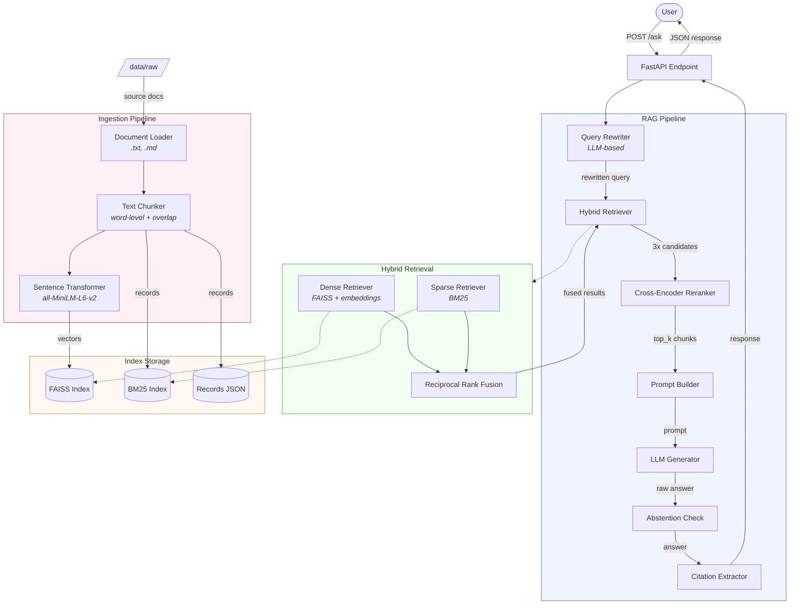

```mermaid
flowchart TD
    User([User]) -->|POST /ask| API[FastAPI Endpoint]

    subgraph Pipeline["RAG Pipeline"]
        direction TB
        QR[Query Rewriter<br/><i>LLM-based</i>]
        HR[Hybrid Retriever]
        RR[Cross-Encoder Reranker]
        PB[Prompt Builder]
        GEN[LLM Generator]
        AB[Abstention Check]
        CE[Citation Extractor]

        QR -->|rewritten query| HR
        HR -->|3x candidates| RR
        RR -->|top_k chunks| PB
        PB -->|prompt| GEN
        GEN -->|raw answer| AB
        AB -->|answer| CE
    end

    subgraph Retrieval["Hybrid Retrieval"]
        direction LR
        DR[Dense Retriever<br/><i>FAISS + embeddings</i>]
        SR[Sparse Retriever<br/><i>BM25</i>]
        RRF[Reciprocal Rank Fusion]
        DR --> RRF
        SR --> RRF
    end

    subgraph Storage["Index Storage"]
        direction LR
        FAISS[(FAISS Index)]
        BM25[(BM25 Index)]
        RECORDS[(Records JSON)]
    end

    subgraph Ingestion["Ingestion Pipeline"]
        direction TB
        LOADER[Document Loader<br/><i>.txt, .md</i>]
        CHUNKER[Text Chunker<br/><i>word-level + overlap</i>]
        EMBEDDER[Sentence Transformer<br/><i>all-MiniLM-L6-v2</i>]
        LOADER --> CHUNKER --> EMBEDDER
    end

    API --> QR
    CE -->|response| API
    API -->|JSON response| User

    HR -.-> Retrieval
    RRF -->|fused results| HR

    DR -.-> FAISS
    SR -.-> BM25

    EMBEDDER -->|vectors| FAISS
    CHUNKER -->|records| BM25
    CHUNKER -->|records| RECORDS

    RAW[/data/raw/] -->|source docs| LOADER

    style Pipeline fill:#f0f4ff,stroke:#4a6fa5
    style Retrieval fill:#f0fff0,stroke:#4a9f4a
    style Storage fill:#fff8f0,stroke:#c88a3a
    style Ingestion fill:#fff0f5,stroke:#a54a6f
```
